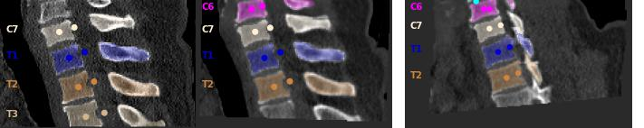

# Pointbased Registration
[](https://zenodo.org/badge/latestdoi/658692903)


This repository gives an example of point-based registrations for nii.gz files. Points can be computed by instance segmentation and/or sub-segmentations. 



See tutorial_pointregistation.ipynb for a tutorial

## Install the package
#### Make venv:
```
conda create -n point_registration python=3.10 
conda install -c simpleitk -c anaconda -c conda-forge nibabel jupyter simpleitk pillow pyparsing matplotlib
pip install antspyx
```
